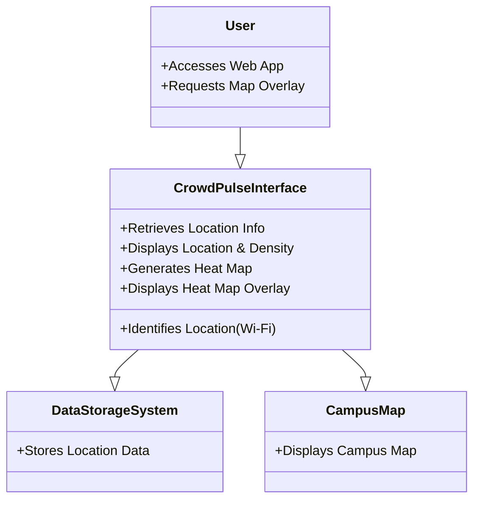
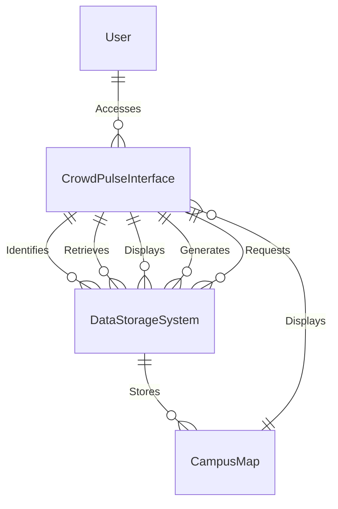
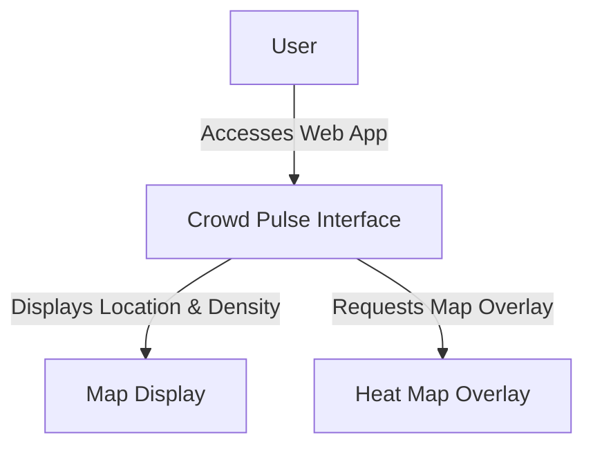

---
tags:
  - G5038-Individual-Project
---

```table-of-contents
style: nestedList # TOC style (nestedList|inlineFirstLevel)
maxLevel: 0 # Include headings up to the speficied level
includeLinks: true # Make headings clickable
debugInConsole: false # Print debug info in Obsidian console
```

### Introduction

This project revolves around the conceptualization, execution, and evaluation of a crowd density and presence detection system. Leveraging either Wi-Fi or IoT devices, the system aims to determine areas of high crowd density, providing users with crucial information for making informed decision making. The name of this project is "Crowd Pulse", this comes from the idea that the system will monitor the how high the crowd density is hence the first word "Crowd" and pulse because it will monitor the "Pulse" of the areas it is deployed in.

The interface in which users will interact with the system will be designed with the intent that anyone can easily use the system to make informed decisions. The interface will most likely be a web application. Web applications have become more popular in recent years as they allow the user a near seamless experience with minimal development costs depending on the type of web application chosen for design [4]. Picking the right kind of web application depends on the functionality, Later in this report I talk about the functionality and which type of web app I believe to be suitable for this project.

#### Project Description

The overarching goal of this initiative is to fashion a modern and efficient solution for monitoring user presence on university campuses. The system aspires to offer the capability to monitor and analyse crowd presence and density across various university areas, employing either Wi-Fi technology or IoT devices. A pivotal focus lies in crafting a system that not only monitors but also enables users to visualize the data in a meaningful way. This visualization aspect is crucial for providing valuable insights into locations with high crowd density. Ultimately, the project seeks to enhance the safety and security of students and staff while optimizing resource allocation and space utilization within the university campus.

#### Motivations

The reason that I wanted to design and implement this kind of system is multi-faceted, I have played many games that revolve around resource management and allocation[5], which has somewhat shaped me into a more efficiency focused person. My second reason is for Academic Growth and Problem Solving, I often find myself looking for the next problem to solve and the opportunity to create a system that not only will solve an issue that I've run into many times but one that solves an issue and also could provide a safer environment for protests and the whole of campus during epidemics was too tempting.

### Project Objectives

The Crowd Pulse Project will be guided using SMART targets / goals these will allow for a more streamlined development process, in this instance SMART refers to a way of setting objectives that are clear, trackable and achievable [8]

#### Primary Objective

The main objective of the project is to design and develop a flexible crowd-detection system. This system should be adept at utilizing either Wi-Fi technology or IoT devices for collecting user data and presenting it to users in an easily comprehensible manner.

#### User-friendly Interface

In pursuit of the primary objective, the project aims to design and develop a user-friendly interface. This interface could take the form of either a web application or a mobile application. The objective is to create a seamless platform for visualizing near-real-time user data.

Expanding on the user-friendly interface, it's crucial to ensure that the design is intuitive and accessible to a diverse user base. Incorporating features such as customizable views, filter options, and updates. This can significantly enhance the user experience. The interface should be responsive and capable of adapting to various screen sizes, making it accessible on both computers and mobile devices.

### Potential Project Extensions

#### Data Visualization

Beyond the primary objectives, the project may be extended by creating an interactive map-based visualization. This visualization will serve the purpose of offering a clear and intuitive representation of user data. Implementing features such as colour-coded density heatmaps, trend lines, and location-specific data overlays could contribute to efficient analysis and decision-making and therefore could be implemented.

#### Scalability

Ensuring the scalability of the system is imperative for its long-term viability. The project aims to develop a system that can be easily expanded to cover various campus locations. This scalability provides the flexibility and adaptability required to meet the evolving needs of the university. Consideration will be given to the system architecture and data management practices to accommodate the potential growth in data and user base. This if implemented may use aspects of a cloud-based solution, however, this needs to be explored further.

#### Historical Data Storage

To augment the utility of the system, there is a focus on implementing a robust system for storing historical data. This functionality would enable trend analysis and offer historical insights into crowd presence and density. Storing historical data is pivotal for identifying patterns, making informed predictions, and understanding long-term trends. This would allow users to make much more informed decisions, as near real-time data has its limits, and historical data would enable more options for project extensions.

#### Real-time Data Analysis

This objective emphasizes the implementation of real-time data collection and analysis. The goal is to provide immediate insights into crowd density and user presence. Real-time data analysis enhances the system's responsiveness and empowers users with timely information for prompt decision-making.

### Professional Considerations

In this section of the report I will go over the BCS code of Conduct [6] and I will justify my project through each of these points in <span style="color:#00b0f0">Blue</span> this way it is easy to identify what the BCS code of conduct outlines and how my project conforms to it. I will also go over the ethical considerations and potential issues related to Crowd Pulse.

#### BCS Code of conduct

1. Public Interest You shall:
   a. have due regard for public health, privacy, security and wellbeing of others and the environment.<span style="color:#00b0f0"> The implementation Crowd Pulse and it's crowd detection technology is intended to improve resource management and space utilisation while respecting individuals' privacy and rights, no personal information of users is available to the system and will never be without the consent of the user</span> 2. b. have due regard for the legitimate rights of Third Parties. c. conduct your professional activities without discrimination on the grounds of sex, sexual orientation, marital status, nationality, colour, race, ethnic origin, religion, age or disability, or of any other condition or requirement. <span style="color:#00b0f0">Crowd Pulse will not have access to this kind of data so there is no change it will be misused</span> 3. d. promote equal access to the benefits of IT and seek to promote the inclusion of all sectors in society wherever opportunities arise. <span style="color:#00b0f0">Crowd Pulse will be available in a way that is inclusive to all those who use it</span>
2. Professional Competence and Integrity You shall:
   1. a. only undertake to do work or provide a service that is within your professional competence. <span style="color:#00b0f0">Crowd Pulse will be developed with my own professional competence in software enginering, system integration, human-computer interaction and data analytics</span>
   2. b. NOT claim any level of competence that you do not possess. <span style="color:#00b0f0">As stated in the previous point I will develop Crowd Pulse using my own professional competence and will not claim to have levels of competence exceeding my own</span>
   3. c. develop your professional knowledge, skills and competence on a continuing basis, maintaining awareness of technological developments, procedures, and standards that are relevant to your field. <span style="color:#00b0f0">Crowd Pulse itself represents a commitment to ongoing learning within multiple fields of professional development by enabling the application of theoretical and practical knowledge as well as an awareness of standards with in Computer science</span>
   4. d. ensure that you have the knowledge and understanding of Legislation\* and that you comply with such Legislation, in carrying out your professional responsibilities. <span style="color:#00b0f0">Crowd Pulse will potentially use network mapping aspects, which I will obtain explicit permission for before hand</span>
   5. e. respect and value alternative viewpoints and, seek, accept and offer honest criticisms of work. <span style="color:#00b0f0">As a developer I will seek to accept criticism and respect and review alternative viewpoints as this furthers my own understanding</span>
   6. f. avoid injuring others, their property, reputation, or employment by false or malicious or negligent action or inaction. <span style="color:#00b0f0">Crowd Pulse's development will endeavour to avoid injuring others in these ways or any other</span>
   7. g. reject and will not make any offer of bribery or unethical inducement. <span style="color:#00b0f0">As a developer I would not accept or make any offers that are of an unethical nature</span>
3. Duty to Relevant Authority You shall:
   1. a. carry out your professional responsibilities with due care and diligence in accordance with the Relevant Authority’s requirements whilst exercising your professional judgement at all times. <span style="color:#00b0f0">I will carry out this project with professional responsibilities and will stay within the realm of aggreged upon requirements and restrictions</span>
   2. b. seek to avoid any situation that may give rise to a conflict of interest between you and your Relevant Authority. <span style="color:#00b0f0">I will endevor to avoid creating situations that give rise to conflict between me and the Relevant Authority (in this case the University as an entity)</span>
   3. c. accept professional responsibility for your work and for the work of colleagues who are defined in a given context as working under your supervision. <span style="color:#00b0f0">I accept that the responsibility for my work is my own and no others and will act as such</span>
   4. d. NOT disclose or authorise to be disclosed, or use for personal gain, or to benefit a third party, confidential information except with the permission of your Relevant Authority, or as required by Legislation. <span style="color:#00b0f0">This Project will not be used on adverse ways as described here</span>
   5. e. NOT misrepresent or withhold information on the performance of products, systems or services (unless lawfully bound by a duty of confidentiality not to disclose such information), or take advantage of the lack of relevant knowledge or inexperience of others. <span style="color:#00b0f0">This project will have the code open source for all to see and will not withhold any information as outlined</span>
4. Duty to the Profession You shall:
   1. a. accept your personal duty to uphold the reputation of the profession and not take any action which could bring the profession into disrepute. <span style="color:#00b0f0">The Personal duty / responsibility is my own as a professional and as such I will behave accordingly during the length of this project</span>
   2. b. seek to improve professional standards through participation in their development, use and enforcement. <span style="color:#00b0f0">Crowd Pulse is a perfect way for me to improve my professional standards through development and I will adhere to the standards professionals are held to</span>
   3. c. uphold the reputation and good standing of BCS, the Chartered Institute for IT. <span style="color:#00b0f0">The BCS' reputation will not be impacted by this project, as this project will adhere to the standards set by the BCS</span>
   4. d. act with integrity and respect in your professional relationships with all members of BCS and with members of other professions with whom you work in a professional capacity. <span style="color:#00b0f0">Any interactions had with BCS members will be done in a professional manner</span>
   5. e. encourage and support fellow members in their professional development. <span style="color:#00b0f0">Crowd Pulse aims to inspire others to follow the professional development set out by the BCS</span>

#### Ethical Issues / Considerations

During development of Crowd Pulse it is important to consider the ethical concerns and implement strategies to address these concerns.

##### Privacy

Due to the nature of the Crowd Pulse project it involves monitoring and analysing crowd presence and density in different locations, this could potentially raise privacy concerns among the individuals being monitored, therefore it is crucial to establish what is acceptable and what is not:

- Acceptable
  - Aggregated and anonymized data collection to ensure individual privacy is maintained.
  - Utilizing technology that focuses on crowd presence and density rather than individual identification.
- Not-Acceptable
  - Monitoring or collecting personally identifiable information[7] without explicit consent.
  - Utilizing surveillance methods that infringe upon individuals’ privacy rights.

##### Data Security

Given the nature of a system that collects and analyses user data, ensuring the security and integrity of the data is of utmost importance, as such Crowd Pulse will endeavour to use the minimal amount of user data possible to ensure there is no useful way for Crowd Pulse to be used to track individuals. In addition to holding as little identifiable data as possible, the data which is required will be thoroughly protected. Outlined below is the strategy I will be implementing to keep the minimal user data stored safe:

1. **Data Minimization**: Crowd Pulse will limit the collection of personal data to only what is necessary for the system's functionality, ensuring that the least amount of identifiable information is gathered. This aligns with privacy principles and reduces the risk associated with unnecessary data storage.
2. **Encryption and Anonymization**: Any data that is collected will be encrypted and anonymized to prevent unauthorized access and to ensure that individual identities cannot be discerned from the stored information.
3. **Compliance with Data Protection Regulations**: Crowd Pulse will adhere to all relevant data protection regulations, ensuring that the handling and storage of user data complies with legal requirements to safeguard user privacy and security.

##### Informed Consent

It is crucial to consider the issue of informed consent. Users and individuals affected by the system's monitoring should be informed about the purpose and scope of data collection and analysis. Clear communication and transparency regarding the utilization of their data, including the option to opt out, are essential ethical considerations.

### Background Research and Similar Projects

In this section I will talk about some of the background research I completed, as well as the similar projects and products out in the world that solve the same problem Crowd Pulse is attempting to solve.0

#### Web Apps

Web apps can come in different forms, for example:

1. **Static Web Application** - As the name implies this type of web app is not flexible and exhibits little content and is hard to change the content easily
2. **Dynamic Web Application** - Dynamic web apps generate data in real-time based on a user's request and a server's response. This type allows changes easily, however is complex on a technical level
3. **Progressive Web Application** - This type is known as a PWA, it is known as a cross-platform web app, whilst also giving a more native experience.
4. **Single Page Applications** - Single page are lightweight and can connect with the website with no interference, they also don't take much time to give responses
5. **Multiple Page Applications** - Similar to an SPA but with multiple mages and slightly slower
6. **Animated Web Applications** - this type supports animation and synchronization on the web platform, allowing you to show up content with animated properties
7. **Portal Web Applications** - Portal Apps are accessible over the web and show up details from difference sources.
8. **Content Management System** - CMS apps help to manage digital content and improve the production and management of content
9. **eCommerce Applications** - Used for shopping auctioning, and any other type of ECommerce worldwide.

The Type of App I plan to develop is a PWA a progressive web application, the reason for this is because it allows for a more native experience, using web apps, allowing the app to be downloaded on any device, which is much more desirable, it allows me to use an Crowd Pulse regardless of my OS.

#### Problem Description

Crowd Pulse aims to address the problem of effectively monitoring and analysing crowd density and presence, within the university campus, there is no way to track the busiest locations on campus currently, and having a way to identify areas with a high density of people is crucial for events such as protests, freshers fair, etc... it will allow security to monitor crowds, which they are currently unable to do, utilising this will help in other areas as well, for example having had this during the time of COVID-19 it would allow individuals to avoid risking exposure to COVID and remain safe, a solution to this problem would also help protect the campus against future issues.

#### Existing Solutions

The Crowd Pulse project aims to create a crowd density presence detection system for monitoring user presence on campuses. Similar Projects in this domain include crowd monitoring systems for public safety and space optimization, for instance a detection systems on trains to show which carriages are the most crowded that was implemented by Thales, a France-based aerospace company, Thales' DIVA solution requires no additional sensors as it utilises the existing CCTV network on stations and on-board trains for measuring passenger density via video analytics in real-time[9].

> [!cite] Thales real-time crowd management solution for railway stations
> DIVA uses three-colour codes, namely red; yellow; and green, to indicate crowd density and guide passengers to avoid crowded places via platform displays.

There is also a similar called Situate project that is being implemented in Bristol Temple Meads train station, it uses a Lidar-based crowd monitoring system that uses AI to track potentially dangerous activity will watch passengers at Bristol Temple Meads train station[10].

> [!cite] Alan Peters - Ecosystem Director - Situate project
> This next stage is when their technologies will really come to life.
>
> We look forward to working with each company during the installation of their systems, and to monitor feedback from members of the public and the station team.

### Requirements Analysis

In the Following Section I will go through some of the functional and non-functional requirements I think are important to implement into Crowd Pulse. I will Cover both mandatory Requirements and Desirable Requirements (coloured in <span style="color:#00b0f0">Blue</span>)

#### Functional Requirements

##### Device Detection

- The System must employ either Wi-Fi technology or IoT devices for user detection
- It should be capable of monitoring and analysing crowd density and presence in various locations

##### <span style="color:#00b0f0"> Real-Time Data Collection & Analysis</span>

- Implementing real-time data collection and analysis to provide immediate insights into crowd density, would be a great bonus to the project, but near real-time data would suffice
- Ideally the system should be responsive and provide timely information

##### <span style="color:#00b0f0">Integration with Existing Infrastructure</span>

- Seamless integration with the university's existing systems would be extremely useful in providing easy of use to the users
- Compatibility with current systems would allow for a more efficient solution

##### User Experience & User Interface (UX and UI)

- Designing and developing a user-friendly interface (web app) for visualising the data would enhance the experience of the users greatly
- <span style="color:#00b0f0">Ideally the system could support customizable views, filter options, and updates for an easy user experience</span>

##### Scalability

- The system must be easily expandable to cover multiple campus locations
- This will need to account for the storage of potential historical data as well

##### <span style="color:#00b0f0">Historical Data Storage</span>

- The System should store some historical data of some kind to draw from to do trend analysis
- The system should enable users to access historical insights

#### Non-Functional Requirements

##### Privacy and Security

- The system must adhere to the privacy principles set out by the university and the BCS, collecting and only aggregating anonymized data

##### Compliance

- The system must comply with relevant legislation and policies set by the relevant authorities

##### Performance

- The system must handle lots of data requests efficiently, ensuring responsiveness
- Data analysis process should be optimized to provide timely insights without significant delays

##### <span style="color:#00b0f0">Reliability</span>

- The system Could have a minimal downtime rate, ensuring operation for critical monitoring purposes
- Data backups should be made regularly to prevent historical data loss

#### Usability

##### Intuitive Design

- The user interface should have a design that is easy to understand and navigate
- Features should be logically organized for convenience

##### Customizability

- Providing customizable views and filter options to cater to different user preferences
- Users should have the flexibility to tailor the interface to their own needs

##### Accessibility

- Ensure that the interface is accessible to users with diverse needs
- Consideration for features like screen readers and other accessibility tools

##### Feedback

- Implementing a feedback mechanism for users to report issues or provide suggestions
- Allows continuous improvement based on user feedback

### Project Plan and Management

I will use a multitude of different ways to manage my project. For source control and backups I will use GitHub [11], my own self hosted server [12], and Google Drive [13], Using GitHub allows me to utilise GitHub issues and projects, which allow me to track tasks easily an example of which is the below Kanban. I will use my google drive as well as my own server to store backups periodically so to avoid backup loss if something were to happen to GitHub. This way I have a higher degree of redundancy baked into the project.

#### Kanban

![[Pasted image 20231123125403.png]]

#### Project Plan

In undertaking the crowd pulse project, it is important to establish a planned methodology, therefore I have come up with the following diagrams and graphs to show how I will proceed with the Crowd Pulse Project.

I have worked with different methodologies before namely agile and waterfall, so I will use a combined approach in the following way, due to the nature of the fixed timeline of the project believe that a waterfall methodology would suite the project well, however I will be using an agile methodology when it comes to the Designing and Coding Phases, this is due to the nature of these phases, the design phases is one that requires rapid development in short amounts of time with a high quality return, in this case using an agile methodology makes sense as it allows me to rapidly prototype designs and evaluate them in a much more efficient way than using a waterfall method. The Same applies to the coding phase of the project it greatly hinder my abilities, so I will be focused on the agile cycle of development when entering the Coding phase.

> [!abstract]- Gantt Chart
> ![[Pasted image 20231123123439.png]]

##### Project Phases

As described above in the Gantt Chart which I developed using Team Gantt[14] The Process of creating Crowd Pulse will be done in phases, these phases are shown in the Gantt Chart, but to go over them again they are:

- <span style="color:#92d050">Ideas / Research Phase</span>
  - In this phase I will be generating ideas looking for similar projects and completing documentation, I will also be more focused on how I will create the end goal rather than what I do to create it.
- <span style="color:#00b0f0">Design Phase</span>
  - During this phase I will be using the agile methodology to generate designs of how the product will look from a user experience point of view, as well as working on the designs for how other parts of the System will function, e.g. Diagrams and prototyping.
- <span style="color:#ffc000">Implementation / Coding</span>
  - During this Phase I will again be using the agile methodology to rapidly produce code that will follow the designs and prototypes developed in the design phase, during this phase I will also be testing as and when required although there will be an entire phase dedicated to testing these tests will be focused on the code specifics.
- <span style="color:#7030a0">Testing</span>
  - In this phase I will test all aspects of the product and work out any bugs that need to be fixed. I also hope to be able to test my product using a group of my peers that way I will be able to replicate the environment it would be used in, I will then be fixing issues that arise due to the testing done by the group of peers.
- <span style="color:#ff0000">Deployment</span>
  - This Phase is dedicated to deploying the product into the wild, in this phase the product is ready, as been thoroughly tested, and is now ready for the users to have access, I will be focused on implementing the code as well as potentially integrating it with the existing systems available.

##### Source Control - GitHub & GiTea

As discussed earlier I will be using GitHub, as well as my own self hosted server, on my server I run a self hosted version of GitHub named GiTea [15]. GiTea, is an alternative of GitHub, the primary goal of GiTea is to make an easy, fast, painless self hosted git service, and as GiTea is written in go it works across all the platforms and architectures that are supported by Go which is a lot). For this project I will only be using GiTea as an extra level of protection or redundancy, This is so that I will always have some form of the project available to me that is under source control, allowing me to have a backup of the project available even if GitHub where to go down.

###### Project / Issue Management

GitHub has a feature called projects, these are things that can be synced to a repo to allow you to manage it's issues and track your progress I will be using it for this exact purpose.

#### Figma Example Interface

![[Pasted image 20231123125302.png]]

#### UML Use case Diagram



#### Entity Relationship Diagram



#### Data Flow Diagram

##### Low Level Diagram



##### Mid Level Diagrams

> [!example]- **Wifi Version**
> `![[Pasted image 20231123123220.png]]

> [!example]- **IoT Version**
> ![[Pasted image 20231123123312.png]]

### Bibliography

[1]M. Mu, “WiFi-based Crowd Monitoring and Workspace Planning for COVID-19 Recovery,” _arXiv.org_, 2020. https://arxiv.org/abs/2007.12250 (accessed Oct. 15, 2023).

[2]X. Li, “Crowd monitoring and detection,” _Ntu.edu.sg_, 2022, doi: https://hdl.handle.net/10356/158434.

[3]“Crowd Monitoring: State-of-the-Art and Future Directions,” _IETE Technical Review_, 2021. https://www.tandfonline.com/doi/abs/10.1080/02564602.2020.1803152 (accessed Oct. 15, 2023).

[4]Sanjay Singh Rajpurohit, “9 Different Types of Web Applications: Benefits | Features | Cost,” _Technource_, May 16, 2022. https://www.technource.com/blog/types-of-web-applications/ (accessed Nov. 20, 2023).

[5]D. Irwin, “The best management games on PC 2023,” _PCGamesN_, Nov. 02, 2023. https://www.pcgamesn.com/best-management-games (accessed Nov. 20, 2023).

[6]BCS, “BCS, THE CHARTERED INSTITUTE FOR IT CODE OF CONDUCT FOR BCS MEMBERS,” Jun. 2015. Available: https://www.bcs.org/media/2211/bcs-code-of-conduct.pdf

[7]“What Is Personally Identifiable Information (PII)? Types and Examples,” _Investopedia_, 2023. https://www.investopedia.com/terms/p/personally-identifiable-information-pii.asp (accessed Nov. 20, 2023).

[8]J. Martins, “What Are SMART Goals? Examples and Templates [2023] • Asana,” _Asana_, Nov. 2023. https://asana.com/resources/smart-goals (accessed Nov. 20, 2023).

### Appendices

#### Appendix A - Project Proposal

By <span style="color:#7030a0">Morgan Plant</span>

##### **Project Summary**

The aim of this project is to design and develop a University Crowd Detection System for monitoring the presence and density of users in different areas of the university. This system will have the flexibility to utilize either Wi-Fi technology or IoT devices to collect user data. In addition, we will create a user-friendly interface, either a web application or a mobile application, to visualize and interact with real-time data on a map of the campus.

##### Project Objective

- The primary objective of this project is to identify high crowd density locations on campus

###### Example Usage

- The project could be used during a pandemic / epidemic, to view the areas with the most people, this can be useful to a user as they can then avoid certain areas, to decrease the risk of infection.
- The project could be used to indicate whether a room / area is full and, which would save time on the part of the user
- This project could be used to help manage protests and other similar events

###### Aims

1. To create a University Crowd Detection System capable of monitoring and analysing crowed presence and density in university locations.
2. To optimize resource allocation and space utilization across the university.
3. To design and develop a user interface for visualizing real-time user data on a map of the campus.
4. To integrate this new resource with the existing infrastructure of the University

##### Objectives

###### **Primary Objectives**

1. **Design and Development**: Develop a flexible and scalable system for user detection using either Wi-Fi technology or IoT devices.
2. **Real-time Data**: Implement real-time data collection and analysis to provide immediate insights.
3. **Integration**: Ensure seamless integration with existing security and resource management infrastructure on campus.
4. **User Interface**: Design and develop a user-friendly interface (web or mobile application) for visualizing real-time user data on a map of the campus.

###### **Secondary Objectives**

1. **Scalability**: Ensure that the system can be easily expanded to cover various campus locations.
2. **Data Visualization**: Create interactive map-based visualizations for better understanding of user data.
3. **Historical Data**: Store historical data for trend analysis and decision-making.
4. **Resource Optimization**: Provide recommendations for resource allocation based on user data.

##### **Project Relevance**

This Project aims to address proper resource allocation, by allowing users to view the areas on campus, such as the library, university shop, etc. that are busy, or help manage crowd control during events, and provide useful data about said events, this project could also contribute to insights for space utilization, safety and security measures, which would make it a valuable tool for campus management. This relates to the degree I am studying for **Computer Science** because this project is centred on aspects of my studies such as, Human-Computer Interaction for creating the interface for users to check, Computer-Security, due to the nature of privacy featured in this project, Computer-Networks as this project will feature either a web-based interface or usage of Wi-Fi Systems to detect users. as well as Data Analysis aspects.

This project will test the skills I have learned in my studied modules, for instance this will test my Software Engineering capabilities, throughout the entire process, the GUI, web-based or not will test my Human-Computer Interaction skills, as the project is related to crowd density, this will involve data analytical skills, as well as Networking skills. as well as professional writing skills

##### **Resources Required**

1. Hardware:
   1. **Detection Devices**: Depending on the chosen technology (Wi-Fi or IoT), I'll need the necessary hardware, such access to Wi-Fi access points or IoT sensors. These devices will be responsible for collecting user data.
   2. **Dedicated Device**: To process and store data
2. Software:
   1. **Development Tools**: Software development tools, including integrated development environments (IDEs), programming languages, and development frameworks for creating the system.
   2. **Data Analysis Software**: Tools for real-time data analysis, data visualization, and data storage.
   3. **User Interface Development Tools**: Software for designing and developing the user-friendly interface, whether it's a web application or a mobile application.
3. Permissions
   1. Obtain the necessary approvals and permissions for installing monitoring equipment on the university campus. This may involve collaboration with university administrators and compliance with data privacy regulations.

##### **Expected Outcomes**

Upon completion of this project, I anticipate the following outcomes:

1. A functional University Crowd Detection System capable of utilizing either Wi-Fi or IoT technology or both.
2. Real-time user presence data.
3. Enhanced resource management and space utilization.
4. An intuitive and interactive user interface for viewing real-time user data featuring a map.

##### **Similar Projects**

- IETE Technical Review. (2021). _Crowd Monitoring: State-of-the-Art and Future Directions_. [online] Available at: https://www.tandfonline.com/doi/abs/10.1080/02564602.2020.1803152 [Accessed 15 Oct. 2023].
- Li, X. (2022). Crowd monitoring and detection. _Ntu.edu.sg_. [online] doi:https://hdl.handle.net/10356/158434.
- Mu, M. (2020). _WiFi-based Crowd Monitoring and Workspace Planning for COVID-19 Recovery_. [online] arXiv.org. Available at: https://arxiv.org/abs/2007.12250 [Accessed 15 Oct. 2023].

##### **Conclusion**

The "University Crowd Detection System" project aims to create a modern and effective solution for monitoring user presence on university campuses while providing a user-friendly interface for visualizing real-time user data on a campus map. It will contribute to the safety and security of students and staff while optimizing resource allocation.
